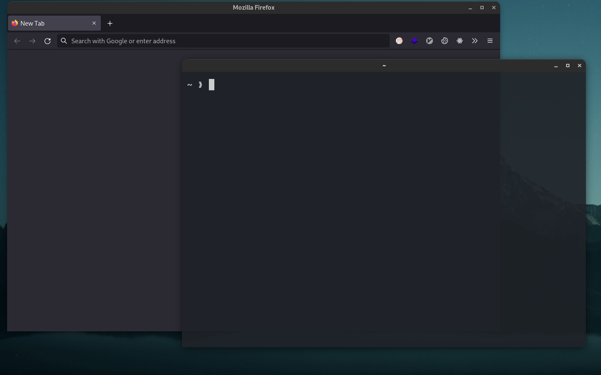

# web-search.fish



A plugin to do a web search via fish.
Inspired by [oh-my-zsh/web-search](https://github.com/ohmyzsh/ohmyzsh/tree/master/plugins/web-search)

## Requirement

- `xdg-open(1)`: [xdg-utils](https://www.freedesktop.org/wiki/Software/xdg-utils/)

## Installation

Install with [Fisher](https://github.com/jorgebucaran/fisher) (recommended):

```sh
fisher install veirt/web-search.fish
```

or manual installation:

```sh
curl -sL https://raw.githubusercontent.com/Veirt/web-search.fish/main/install.fish | fish
```

## Usage

```sh
web-search google nyahello, world
```

You can also define aliases in your fish config:

```fish
alias google="web-search google"
alias stackoverflow="web-search stackoverflow"
alias github="web-search github"
```

And now, you can also do it like this:

```sh
google nyahello, world
```

Available search contexts:

| Context         | URL                                                |
| --------------- | -------------------------------------------------- |
| `google`        | `https://www.google.com/search?q=`                 |
| `youtube`       | `https://www.youtube.com/results?search_query=`    |
| `bing`          | `https://www.bing.com/search?q=`                   |
| `yahoo`         | `https://search.yahoo.com/search?p=`               |
| `duckduckgo`    | `https://www.duckduckgo.com/?q=`                   |
| `startpage`     | `https://www.startpage.com/do/search?q=`           |
| `yandex`        | `https://yandex.ru/yandsearch?text=`               |
| `github`        | `https://github.com/search?q=`                     |
| `baidu`         | `https://www.baidu.com/s?wd=`                      |
| `ecosia`        | `https://www.ecosia.org/search?q=`                 |
| `goodreads`     | `https://www.goodreads.com/search?q=`              |
| `qwant`         | `https://www.qwant.com/?q=`                        |
| `givero`        | `https://www.givero.com/search?q=`                 |
| `stackoverflow` | `https://stackoverflow.com/search?q=`              |
| `wolframalpha`  | `https://wolframalpha.com/input?i=`                |
| `archive`       | `https://web.archive.org/web/*/`                   |
| `scholar`       | `https://scholar.google.com/scholar?q=`            |
| `nixpkgs`       | `https://search.nixos.org/packages?query=`         |
| `nixoptions`    | `https://search.nixos.org/options?query=`          |
| `aur`           | `https://aur.archlinux.org/packages?K=`            |
| `gpo`           | `https://gpo.zugaina.org/Search?search=`           |
| `searx`         | `https://searx.org/search?q=`                      |
| `brave`         | `https://search.brave.com/search?q=`               |
| `urbandict`     | `https://www.urbandictionary.com/define.php?term=` |
| `deepl`         | `https://www.deepl.com/translator#auto/auto/`      |
| `dockerhub`     | `https://hub.docker.com/search?q=`                 |
| `npmpkg`        | `https://www.npmjs.com/search?q=`                  |
| `packagist`     | `https://packagist.org/?query=`                    |
| `gopkg`         | `https://pkg.go.dev/search?m=package&q=`           |

## Custom Search

Additionally, you can set up a custom search with a different URL by defining
a new environment variable with a `WEB_SEARCH_` prefix and a unique context name.
Simply set the URL you desire as the value for this new environment variable.

For example, if you want to make a search to the URL
`https://dictionary.cambridge.org/dictionary/english/` with the context `dict`, you
can use the following command or put it directly in your `config.fish`:

```sh
set -gx WEB_SEARCH_dict 'https://dictionary.cambridge.org/dictionary/english/'
```

You can now search with:

```sh
web-search dict word
```

Or, with an alias:

```sh
alias dict='web-search dict'
dict word
```

## Credits

- [oh-my-zsh/web-search](https://github.com/ohmyzsh/ohmyzsh/tree/master/plugins/web-search). Licensed under [MIT](https://choosealicense.com/licenses/mit/)

## FAQ

> Why is it not opening my browser of choice?

Run this command in your shell. For example, if you want to change it to Firefox:

```sh
xdg-settings set default-web-browser firefox.desktop
```

You can replace `firefox.desktop` with whatever the name of your browser desktop entry:

- Google Chrome: `google-chrome.desktop`
- Chromium: `chromium.desktop`

You can find your browser's desktop entry in `/usr/share/applications/` or in `~/.local/share/applications/`

## License

[ GNU GPLv3 ](https://choosealicense.com/licenses/gpl-3.0/)
